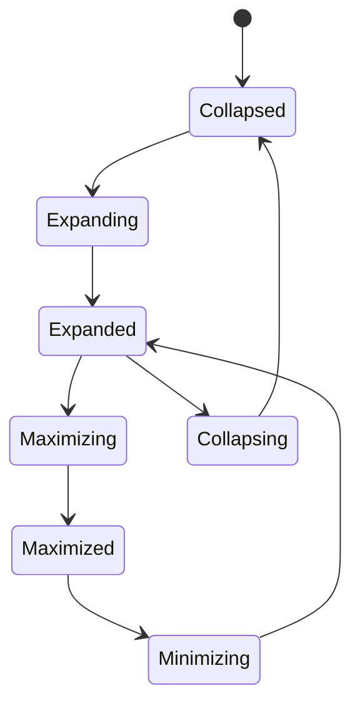

# Hierarchical Activity Focus Pattern

## Zweck

Dieses Dokument beschreibt ein generisches Interaktions- und Animationspattern fuer Anwendungen, in denen Aktivitaeten, Schritte, Knoten oder Arbeitsobjekte hierarchisch strukturiert sind. Das Pattern ist nicht auf Workflow-Tools beschraenkt. Es kann ebenso in Diagramm-Editoren, Prozessmodellierung, Wissenssystemen, Whiteboards, Architektur-Tools oder anderen strukturierenden Anwendungen eingesetzt werden.

Der Kern des Patterns ist ein vierstufiger Fokuspfad:

1. `Expand`
2. `Maximize`
3. `Minimize`
4. `Collapse to Origin`

Das Ziel ist ein dauerhaft stabiles mentales Modell:

- Eine Aktivitaet ist nicht nur ein Knoten, sondern ein moeglicher Träger einer tieferen Struktur.
- Eine untergeordnete Struktur entsteht sichtbar aus derselben Aktivitaet.
- Der Uebergang in den Bearbeitungskontext ist kontinuierlich, nicht diskret.
- Die Rueckkehr erfolgt entlang derselben räumlichen Logik.

## Wann dieses Pattern sinnvoll ist

Das Pattern ist geeignet, wenn folgende Bedingungen gleichzeitig gelten:

- Objekte besitzen eine rekursive oder hierarchische Struktur.
- Benutzer muessen zwischen Uebersicht und Detailebene wechseln.
- Die Herkunft einer Detailansicht soll jederzeit räumlich nachvollziehbar bleiben.
- Ein harter Seitenwechsel, Dialog oder Layer-Sprung wuerde die Orientierung verschlechtern.
- Die Benutzeroberflaeche soll Hierarchie nicht nur darstellen, sondern im Verhalten verankern.

Nicht geeignet ist das Pattern fuer:

- flache Listen ohne Hierarchie
- reine Formularanwendungen
- Systeme, in denen Details grundsaetzlich modal und isoliert bearbeitet werden sollen
- Faelle, in denen Unterstrukturen keinen visuellen Bezug zum Ursprungselement haben muessen

## Mentales Modell

Die grundlegende Aussage des Patterns lautet:

`Dieselbe Aktivitaet existiert in mehreren Aufloesungsstufen, nicht in mehreren unverbundenen Screens.`

Der Benutzer soll zu jedem Zeitpunkt beantworten koennen:

1. Welche Aktivitaet sehe ich gerade?
2. Ist das dieselbe Aktivitaet wie zuvor, nur detaillierter?
3. In welchem Parent-Kontext liegt sie?
4. Wie komme ich sichtbar in denselben Ursprung zurueck?

Die Animation ist dabei kein Schmuck. Sie ist der eigentliche Träger des mentalen Modells.

## Zustandsmodell

Das Pattern verwendet vier stabile Nutzerzustaende und drei Uebergangsphasen:

- `Collapsed`
- `Expanded`
- `Maximized`
- `Collapsed after return`

Uebergangsphasen:

- `Expanding`
- `Maximizing`
- `Minimizing`
- `Collapsing`

Zulaessige Sequenz:

Wichtige Regel:

- `Maximized -> Collapsed` ist nicht erlaubt.
- Die Rueckkehr laeuft immer ueber `Minimize -> Expanded -> Collapse`.

## Benutzerinteraktion

### 1. Expand

`Expand` ist eine Vorschau-Aktion.

Der Benutzer oeffnet keine neue Ebene und keinen neuen Bildschirm. Stattdessen vergroessert sich die gewaehlte Aktivitaet sichtbar aus ihrer aktuellen Position. Die entstehende Vorschau wandert in die Mitte der sichtbaren Arbeitsflaeche, bleibt aber als dieselbe Aktivitaet lesbar.

Ziel von `Expand`:

- den Child-Kontext sichtbar machen
- den Parent-Kontext noch erkennbar lassen
- die Herkunft der Child-Struktur manifestieren
- den Benutzer auf den eigentlichen Bearbeitungswechsel vorbereiten

Die Vorschau ist absichtlich kein vollwertiger Editor. Sie ist ein orientierender Zwischenzustand.

### 2. Maximize

`Maximize` ist der eigentliche Bearbeitungswechsel.

Die bereits sichtbare Vorschau wird nicht ersetzt. Sie transformiert sichtbar in die primaere Arbeitsflaeche fuer den untergeordneten Bereich. Genau diese Kontinuitaet ist entscheidend: Das Objekt, das gerade als Vorschau sichtbar war, wird zum aktiven Workspace.

Ziel von `Maximize`:

- aus Orientierung produktive Bearbeitung machen
- den Child-Kontext zum Hauptarbeitsbereich machen
- den Eindruck eines neuen, unverbundenen Screens vermeiden

### 3. Minimize

`Minimize` ist kein Schliessen. Es ist die Rueckkehr vom Bearbeitungsmodus in den Vorschauzustand innerhalb des Parent-Kontexts.

Die Child-Arbeitsflaeche verkleinert sich sichtbar und wird wieder zur zentrierten Vorschau innerhalb der uebergeordneten Arbeitsflaeche.

### 4. Collapse to Origin

`Collapse` fuehrt die Vorschau sichtbar zur Ursprungsaktivitaet zurueck.

Die Vorschau darf nicht einfach verschwinden. Sie muss in dieselbe Aktivitaet zurücklaufen, aus der sie entstanden ist. Erst dann ist die Hierarchie auch im Verhalten vollstaendig geschlossen.

## Darstellungslogik

### Collapsed

Die Aktivitaet erscheint als kompakter Knoten oder Schritt im Parent-Workspace.

Sie zeigt nur das Notwendige:

- Name oder Rolle
- ggf. Status oder Kerndaten
- eine sichtbare Affordanz fuer `Expand`, sofern Child-Inhalt vorhanden ist

### Expanded

Die Aktivitaet wird zur zentrierten Vorschau.

Eigenschaften:

- Ursprung ist die reale Position der Aktivitaet
- Ziel liegt im Zentrum der aktuellen View
- Groesse ergibt sich aus dem Inhalt der Child-Struktur
- Parent bleibt sichtbar, aber tritt als Kontext zurueck
- die Vorschau ist gross genug, um alle Child-Elemente in aktueller Canvas-Skalierung darzustellen

Die Vorschau soll nicht fullscreen wirken. Sie ist bewusst als Fokusfenster innerhalb des Parent-Kontexts zu lesen.

### Maximized

Die Vorschau transformiert in den vollwertigen Workspace fuer den Child-Bereich.

Eigenschaften:

- derselbe Inhalt
- derselbe visuelle Zusammenhang
- mehr Platz
- voller Bearbeitungsmodus
- Parent ist nicht mehr aktiver Arbeitskontext

## Animationskonzept

## Prinzip

Die Animation folgt einem `scale to focus`-Prinzip, nicht einem Morphing- oder Teleporting-Prinzip.

Es gilt:

- Das Ursprungsrechteck ist die echte Aktivitaet im Parent.
- Das Zielrechteck von `Expand` ist eine zentrierte Vorschau.
- Das Zielrechteck von `Maximize` ist der Workspace fuer den Child-Bereich.
- Rueckwege verwenden dieselben Rechtecke in umgekehrter Richtung.

### Expand Animation

Bei `Expand` passiert Folgendes gleichzeitig:

- Die Aktivitaet skaliert vom Ursprungsrechteck zur Vorschaugroesse.
- Die Vorschau bewegt sich ins Zentrum der aktuellen View.
- Der Parent-Kontext wird gedimmt, aber nicht ausgeblendet.
- Child-Elemente werden innerhalb der Vorschau sichtbar.

Wichtig:

- Das Ziel ist nicht volle Flaechennutzung.
- Das Ziel ist eine lesbare Vorschau des Child-Bereichs.

### Maximize Animation

Bei `Maximize` passiert Folgendes gleichzeitig:

- Die Vorschau vergroessert sich vom Vorschau-Rechteck zum Workspace-Rechteck.
- Der Child-Kontext bleibt derselbe, nur die Arbeitsflaeche waechst.
- Der Parent-Kontext verliert seine aktive Rolle.

Wichtig:

- Der Inhalt darf nicht wie ein neu geladener Screen erscheinen.
- Die Vorschau muss sichtbar in den Editor uebergehen.

### Minimize Animation

Bei `Minimize` passiert Folgendes gleichzeitig:

- Der Child-Workspace skaliert vom Editor-Rechteck zurueck ins Vorschau-Rechteck.
- Der Parent-Kontext wird wieder lesbar und relevant.

### Collapse to Origin Animation

Bei `Collapse` passiert Folgendes gleichzeitig:

- Die Vorschau skaliert vom zentrierten Vorschau-Rechteck zurueck in das Ursprungselement.
- Die Dimmung des Parent-Kontexts wird aufgehoben.
- Die Ausgangsaktivitaet ist am Ende wieder der einzige sichtbare kompakte Traeger der Child-Struktur.

## Geometrieregeln

### Ursprung

Der Startpunkt der Transition ist immer das reale Bounding-Rect der ausgewaehlten Aktivitaet im Parent-Workspace.

### Vorschauziel

Das Vorschauziel wird inhaltlich bestimmt:

- gross genug fuer alle Child-Elemente
- unter Beibehaltung des aktuellen Canvas-Zoomfaktors
- mit definierter Innenpolsterung
- zentriert innerhalb der aktuellen sichtbaren Flaeche

Die Vorschau ist damit `content-fit centered`, nicht `fullscreen`.

### Maximierungsziel

Das Maximize-Ziel ist die aktive Arbeitsflaeche fuer den Child-Bereich:

- typischerweise fast volle View-Groesse
- mit systematischem Rand
- voll nutzbar fuer Bearbeitung

## Wahrnehmungsebenen

Im expandierten Zustand muessen mindestens drei Ebenen lesbar sein:

1. `Focused object`: die expandierte Aktivitaet als Vorschau
2. `Child content`: der untergeordnete Bereich innerhalb der Vorschau
3. `Parent context`: der uebergeordnete Bereich als gedimmter Hintergrund

Im maximierten Zustand verschiebt sich die Gewichtung:

1. `Active workspace`: Child-Bereich
2. `System chrome`: notwendige Navigations- und Bearbeitungsfunktionen
3. `Parent memory`: nur noch indirekt ueber Rueckaktion und Kontinuitaet praesent

## Interaktionsregeln

- Nur Aktivitaeten mit Child-Inhalt duerfen expandierbar sein.
- Waehren `Expanding`, `Maximizing`, `Minimizing` und `Collapsing` sind konkurrierende Aktionen gesperrt.
- `Expand` ist Vorschau, `Maximize` ist Bearbeitung.
- `Minimize` ist Rueckfuehrung zur Vorschau, nicht direktes Schliessen.
- `Collapse` ist die Rueckkehr in den Ursprung.
- Die Ruecknavigation muss symmetrisch und sichtbar erfolgen.

## Accessibility und Reduced Motion

Das Pattern muss auch ohne volle Bewegung verstehbar bleiben.

Deshalb gilt:

- `Expand`, `Maximize`, `Minimize` und `Collapse` brauchen Tastaturpfade.
- Reduced Motion verkuerzt die Bewegung, beseitigt aber nicht die Zustandslogik.
- Auch im Reduced-Motion-Modus muss klar bleiben, welcher Zustand gerade aktiv ist.

## Gestaltungsleitlinien

- Die Expand-Vorschau muss visuell als Vorschau lesbar sein, nicht als zufaelliger Zwischenzustand.
- Der Maximized-Editor muss als derselbe Bereich lesbar bleiben, nur in voller Arbeitsgroesse.
- Die Dimmung des Parent-Kontexts darf Orientierung reduzieren, aber nicht zerstoeren.
- Ein harter View-Replacement-Eindruck ist ein Designfehler.
- Die Ruecktransition muss genauso ernst genommen werden wie der Hinweg.

## Implementierungsrichtlinien

Technisch sollte das Pattern getrennt in drei Dinge aufgeteilt werden:

1. `Strukturmodell`
   Aktivitaeten koennen Child-Aktivitaeten enthalten.
2. `Zustandsmaschine`
   Collapsed, Expanded, Maximized plus Uebergangsphasen.
3. `Geometrie-Engine`
   Ursprung, Vorschauziel und Maximierungsziel als Rechtecke mit klaren Transformationsregeln.

Empfohlene Implementierungslogik:

- Beim `Expand` Vorschau sofort mounten, aber mit Ursprungstransform starten.
- Dann in das zentrierte Vorschau-Rechteck interpolieren.
- Beim `Maximize` denselben Inhalt vom Vorschau-Rechteck in das Editor-Rechteck transformieren.
- Beim `Minimize` denselben Weg rueckwaerts.
- Beim `Collapse` Vorschau in das Ursprungselement zurueckfuehren und danach unmounten.

## Akzeptanzkriterien

- Der Benutzer erkennt beim Expandieren, welche konkrete Aktivitaet vergroessert wird.
- Die Vorschau landet sichtbar im Zentrum der aktuellen View.
- Die Vorschau ist nur so gross wie fuer die Child-Struktur notwendig.
- Die Vorschau ist als Vorschau interpretierbar und nicht als neuer Vollbild-Editor.
- Maximieren wirkt wie das Aufziehen derselben Vorschau zum Editor.
- Minimieren wirkt wie die Rueckkehr desselben Editors zur Vorschau.
- Collapse fuehrt sichtbar in dieselbe Ursprungsaktivitaet zurueck.
- Kein Schritt wirkt wie Teleportieren oder harter Screenwechsel.

## Kurzform fuer Produktteams

Wenn das Pattern in einem Satz beschrieben werden soll:

`Eine hierarchische Aktivitaet vergroessert sich zuerst zur zentrierten Vorschau ihres Child-Kontexts und transformiert erst auf expliziten Wunsch weiter zum vollwertigen Workspace; die Rueckwege laufen sichtbar in derselben Logik zurueck bis in den Ursprung.`
